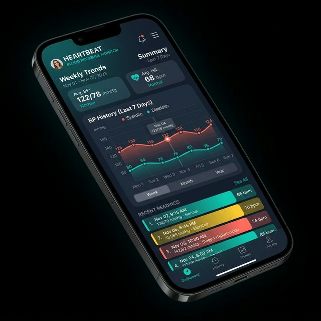
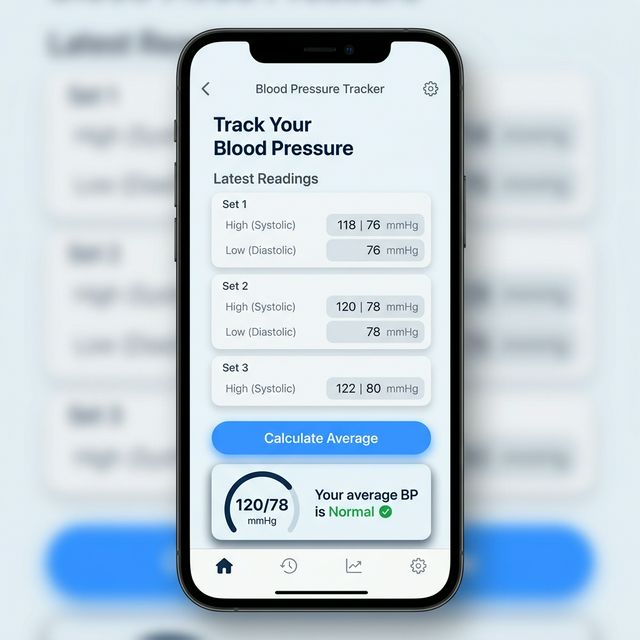
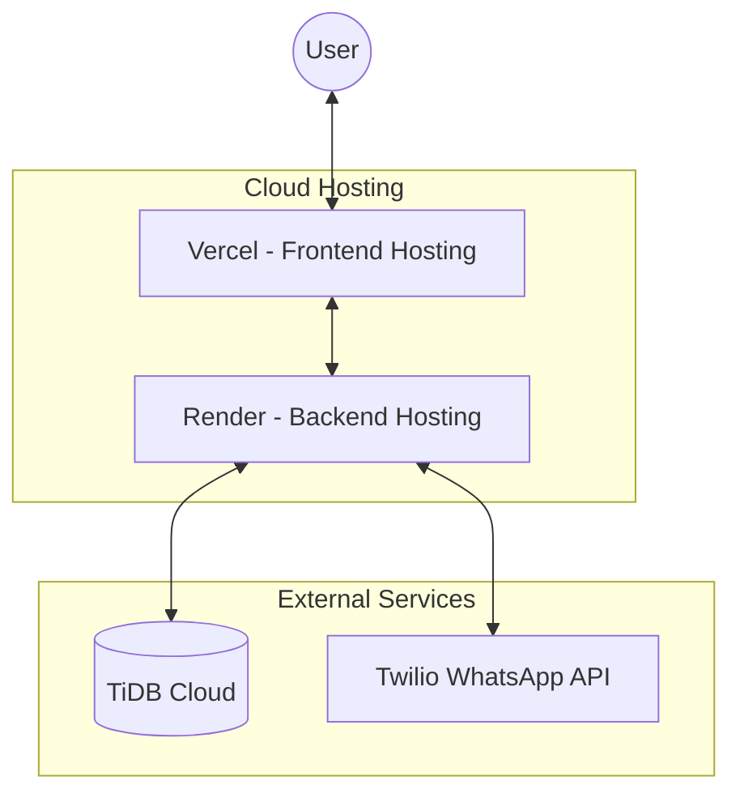
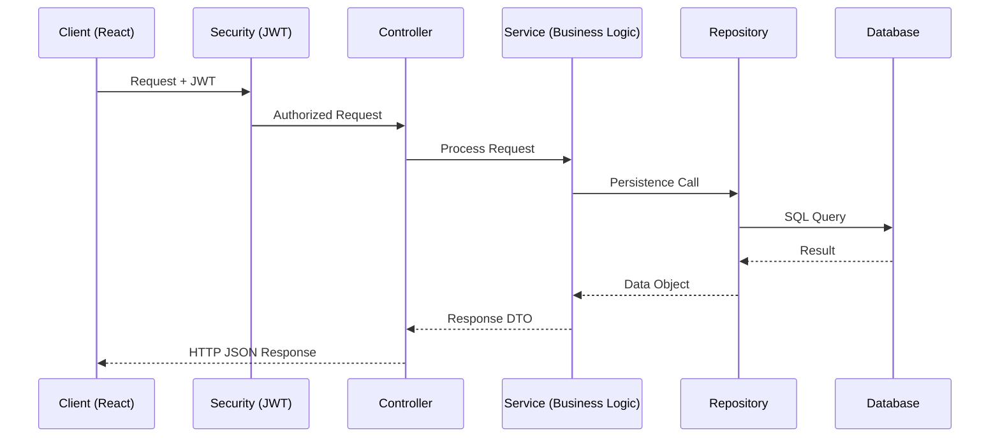
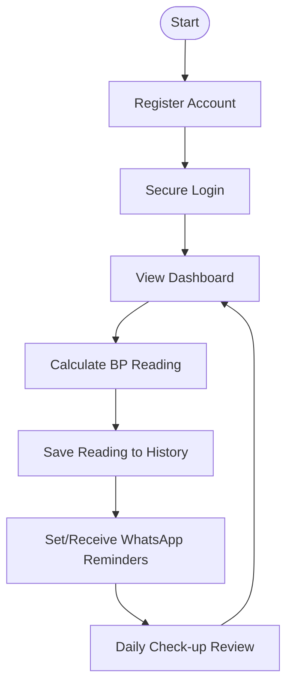

# <p align="center">🩺 BP Monitoring Application</p>

<p align="center">
  
  
  
  
</p>


---

## 📖 Table of Contents
- [✨ Key Features](#-key-features)
- [📸 Visual Tour](#-visual-tour)
- [🏗️ Design Documentation](#-design-documentation)
  - [📐 High-Level Design (HLD)](#-high-level-design-hld)
  - [🔍 Low-Level Design (LLD)](#-low-level-design-lld)
- [🗺️ User Journey & Steps](#-user-journey--steps)
- [🛠️ Technology Stack](#-technology-stack)
- [🚀 Quick Start](#-quick-start)
- [📦 Deployment Guide](#-deployment-guide)
- [🤝 Contributing](#-contributing)

---

## ✨ Key Features

| Feature | Description |
| :--- | :--- |
| **📊 Interactive Dashboard** | Visualize blood pressure trends with dynamic charts and history logs. |
| **🧮 Smart BP Calculator** | Input multiple readings for precise average systolic/diastolic calculations. |
| **📱 WhatsApp Reminders** | Daily check-up reminders sent directly to your phone via Twilio. |
| **🔒 Secure Auth** | Robust user management with JWT-based security and password protection. |
| **📱 PWA Ready** | Install on mobile for a native-like experience. |
| **🛡️ Admin Control** | Comprehensive panel to manage users and oversee system health. |

---

## 📸 Visual Tour

````carousel

<!-- slide -->

<!-- slide -->

````

---

## 🏗️ Design Documentation

<details>
<summary><b>📐 Click to Expand: High-Level Design (HLD)</b></summary>

The BP Monitoring Application is built on a distributed cloud architecture. The frontend is a decoupled React PWA that communicates with a Spring Boot REST API.

#### HLD Architecture Diagram

</details>

<details>
<summary><b>🔍 Click to Expand: Low-Level Design (LLD)</b></summary>

The backend follows a standard layered architecture with Spring Boot.

-   **Security Layer**: Intercepts requests for JWT validation (`JwtFilter`).
-   **Controller Layer**: Handles HTTP requests (`BpRecordController`, `UserController`).
-   **Service Layer**: Contains business logic and Twilio triggers.
-   **Repository Layer**: Interfaces with the database via Spring Data JPA.

#### LLD Component Interaction

</details>

---

## 🗺️ User Journey & Steps

To ensure a seamless experience, the application follows a logical flow from onboarding to daily monitoring.

#### User Action Flowchart


---

## 🛠️ Technology Stack

| Component | Technology |
| :--- | :--- |
| **Frontend** | React, Vite, Recharts, Lucide Icons, PWA |
| **Backend** | Java, Spring Boot, Spring Security, JWT, Hibernate |
| **Database** | TiDB Cloud (MySQL Compatible) |
| **Deployment** | Docker, Render (Backend), Vercel (Frontend) |
| **Messaging** | Twilio WhatsApp Business API |

---

## 🚀 Quick Start

<details>
<summary><b>⚙️ Local Setup Instructions</b></summary>

### Prerequisites
- Java 17+
- Node.js 18+
- MySQL or TiDB Instance
- Twilio Account

### Steps

1. **Clone the Repository**
   ```bash
   git clone https://github.com/your-repo/bp-monitoring-app.git
   cd bp-monitoring-app
   ```

2. **Backend Setup**
   - Config path: `backend/src/main/resources/application.properties`
   ```bash
   cd backend
   mvn spring-boot:run
   ```

3. **Frontend Setup**
   - Set `VITE_API_URL=http://localhost:8080` in `.env`
   ```bash
   cd frontend
   npm install
   npm run dev
   ```
</details>

---

## 📦 Deployment Guide

> [!IMPORTANT]
> For a detailed, step-by-step deployment guide for Render, Vercel, and TiDB Cloud, please refer to:
> 👉 **[Deployment Guide (README_DEPLOY.md)](./README_DEPLOY.md)**

---

## 🤝 Contributing

Contributions are welcome! Please feel free to submit a Pull Request.

1. Fork the Project
2. Create your Feature Branch
3. Commit your Changes
4. Push to the Branch
5. Open a Pull Request

---

<p align="center">
  Developed with ❤️ for better health monitoring.
</p>
